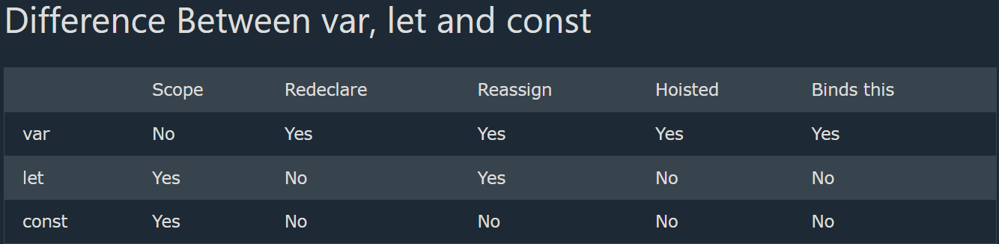

`let` - block variable
`var` - global variable
`const` = constant variable

```javascript
{
  var x = 2;
  let y = 3;
}

// x CAN be used here
// y CANNOT be used here
```

Don't redeclare a variable within the same scope


```javascript
let x = 10;
// Here x is 10

{
let x = 2;
// Here x is 2
}

// Here x is 10
```
<br>


